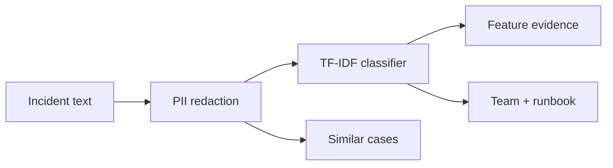

# SignalDesk AI

SignalDesk is a working, privacy-first incident intelligence system. It converts an unstructured alert into an explainable category, responder team, severity, runbook, and similar resolved cases—without sending incident text to an external model.

## What makes it production-minded

- Trains a six-class NLP model on a versioned incident corpus.
- Reports 81.7% accuracy and 81.7% macro F1 under 5-fold stratified cross-validation on the bundled 60-incident corpus.
- Redacts emails, IP addresses, and common secret formats before inference.
- Explains predictions using positively weighted input features.
- Retrieves semantically similar historical incidents and resolutions.
- Exposes health, model metadata, and feedback endpoints.
- Runs as a non-root, health-checked container with CI tests and Trivy scanning.

## Run it

```bash
python -m venv .venv
source .venv/bin/activate
pip install -r requirements.txt
python -m unittest discover -v
python -m signaldesk.evaluate
python -m signaldesk.server
```

Open `http://localhost:8090`, choose a sample or enter an incident, and inspect the classification evidence and retrieved cases.

## Model card

- **Task:** single-label routing across authentication, compute, database, deployment, network, and security.
- **Model:** TF-IDF word/phrase features with logistic regression, calibrated with a transparent versioned operations lexicon.
- **Evaluation:** 5-fold stratified cross-validation, generated into `reports/metrics.json`.
- **Privacy:** deterministic redaction occurs before vectorization; requests are processed in memory and are not persisted.
- **Limitations:** the bundled corpus is intentionally small and demonstrates the ML lifecycle. Human confirmation is required before operational action, and unfamiliar incidents should be treated as low-confidence.

## Architecture



## Repository map

- `signaldesk/` - training data, model, retrieval, redaction, API, and evaluation
- `web/` - responsive incident workspace
- `tests/` - model behavior, privacy, retrieval, and validation tests
- `.github/workflows/` - model verification and container security

## Author

Sukhraj Singh — Computer Science student and Network Lab Engineer co-op building reliable cloud and AI systems.
